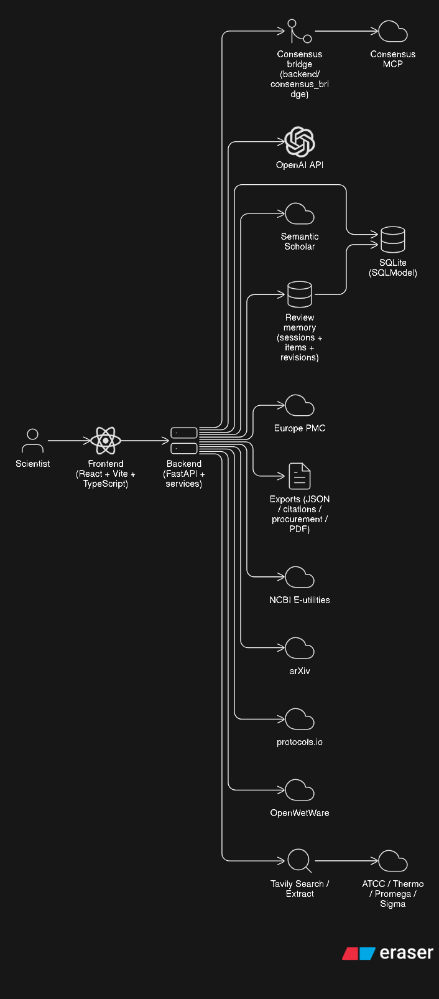
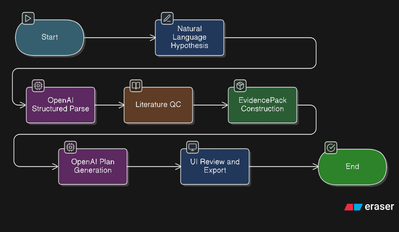
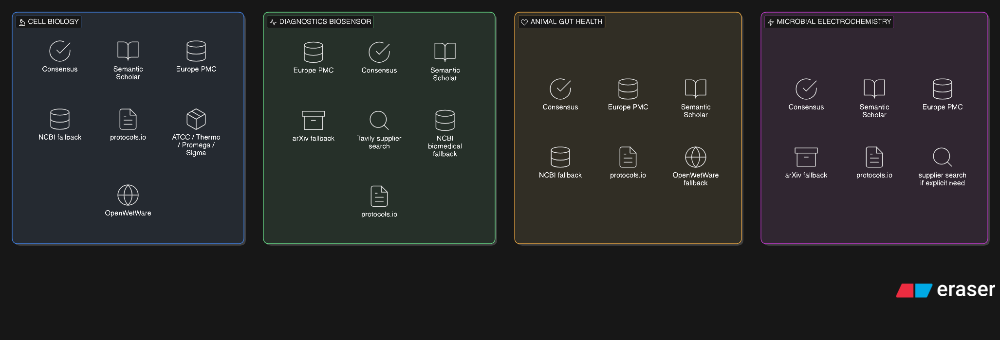
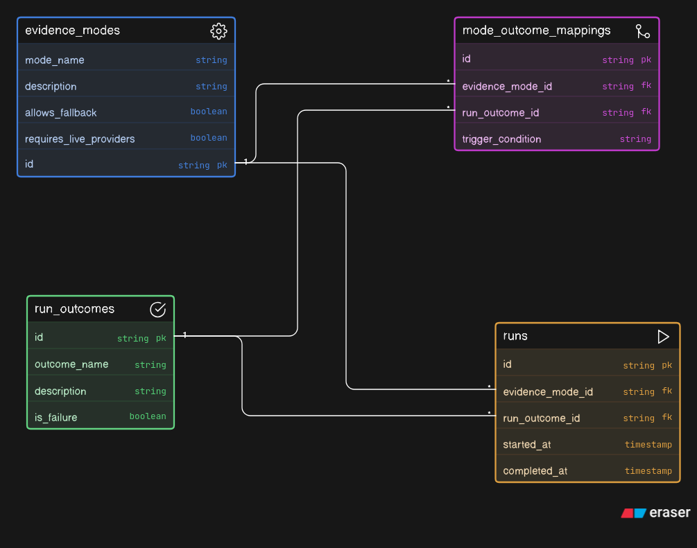
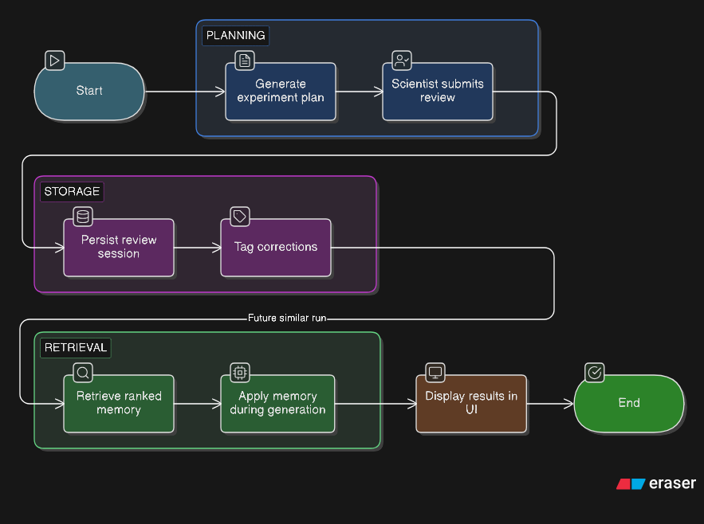

# ProtocolOps

ProtocolOps is an evidence-grounded scientific planning app that turns a natural-language hypothesis into a review-ready experiment plan with Literature QC, source provenance, procurement status, exports, and structured scientist feedback memory.

ProtocolOps does **not** generate final lab-approved SOPs. It produces an operational plan for expert review.

> Verified proof run: the HeLa strict-live path is verified with run `d4f6d470-5c47-4568-9eac-019815a80bb3`.

## Pipeline

The application follows one fixed pipeline:

1. Natural-language scientific hypothesis
2. OpenAI structured hypothesis parsing
3. Literature QC
4. EvidencePack construction
5. OpenAI structured experiment-plan generation
6. UI rendering with evidence, confidence, source provenance, procurement status, expert-review flags, exports, and review memory

## Stack

- `backend/`: FastAPI, Pydantic, SQLModel, SQLite, httpx, OpenAI SDK
- `frontend/`: React, Vite, TypeScript, Tailwind, lucide-react
- `backend/consensus_bridge/`: local HTTP sidecar for Consensus MCP

## Documentation

- [Docs hub](docs/README.md)
- [Architecture](docs/02_ARCHITECTURE.md)
- [API reference](docs/05_API_REFERENCE.md)
- [Local setup and live mode](docs/06_LOCAL_SETUP_AND_LIVE_MODE.md)
- [Scientist review loop](docs/08_SCIENTIST_REVIEW_LOOP.md)
- [Diagram browser](docs/diagrams/README.md)
- [Video page](docs/videos.html)
- [Security and secrets](SECURITY_AND_SECRETS.md)
- [Evaluation checklist](EVALUATION_CHECKLIST.md)
- [Judge quickstart](JUDGE_QUICKSTART.md)
- [Submission notes](SUBMISSION_NOTES.md)
- [Resource routing spec](RESOURCE_ROUTING.md)

## Architecture at a glance

<p align="center">
  
</p>

<p align="center">
  <a href="docs/diagrams/README.md">Browse the full diagram gallery</a>
</p>

## Videos

The demo and technical videos are available on the project video page:

[Watch ProtocolOps videos](https://moujoudix.github.io/ProtocolOps/videos.html)

Direct files are also available in the repository:

- [Demo video: ProtocolOps user workflow](docs/videos/demo.mp4)
- [Technical video: architecture and implementation](docs/videos/tech.mp4)

The demo video shows the HeLa cryopreservation workflow: hypothesis input, Literature QC, EvidencePack-backed plan generation, materials and procurement checks, sources, and review/export actions.

The technical video explains the FastAPI + React architecture, Consensus-first Literature QC, provider routing, OpenAI structured outputs, Pydantic guardrails, and strict-live/cached-live evidence modes.

## Diagram gallery

<table>
  <tr>
    <td align="center">
      <a href="docs/diagrams/README.md#three-stage-workflow">
        
      </a>
      <br />
      <sub><strong>Three-stage workflow</strong></sub>
    </td>
    <td align="center">
      <a href="docs/diagrams/README.md#provider-routing">
        
      </a>
      <br />
      <sub><strong>Provider routing</strong></sub>
    </td>
  </tr>
  <tr>
    <td align="center">
      <a href="docs/diagrams/README.md#evidence-modes">
        
      </a>
      <br />
      <sub><strong>Evidence modes</strong></sub>
    </td>
    <td align="center">
      <a href="docs/diagrams/README.md#review-memory-loop">
        
      </a>
      <br />
      <sub><strong>Review memory loop</strong></sub>
    </td>
  </tr>
</table>

For full-size renders and the `.puml` sources, see the [diagram browser](docs/diagrams/README.md).

## Diagrams

- [Diagram browser with PNG previews](docs/diagrams/README.md)
- [PlantUML source directory](docs/diagrams)

## Quickstart

### Backend

```bash
python3 -m venv .venv
cd backend
cp .env.example .env
../.venv/bin/python -m pip install -e ".[dev]"
../.venv/bin/uvicorn app.main:app --reload --host 127.0.0.1 --port 8000
```

### Consensus bridge

```bash
cd backend
../.venv/bin/python -m consensus_bridge.main
```

### Frontend

```bash
cd frontend
npm install
npm run dev
```

By default, the Vite dev server proxies `/api` and `/health` to `http://localhost:8000`.

For the presentation stack on backend port `8002`:

```bash
cd frontend
VITE_BACKEND_TARGET=http://127.0.0.1:8002 npm run dev -- --host 127.0.0.1 --port 5175
```

## Evidence modes and run outcomes

ProtocolOps distinguishes **configured evidence modes** from **realized run outcomes**.

Configured evidence modes:

- `strict_live`: real providers only; no seeded fallback
- `cached_live`: replay of a previously successful live-provider run
- `seeded_demo`: deterministic fallback for local demos and provider outages

Realized run outcomes:

- `fully_live`: all required live-provider conditions succeeded
- `degraded_live`: live run completed, but one or more providers partially failed
- `demo_fallback`: seeded evidence was used

## Verified proof run

The repository includes a verified HeLa strict-live proof run:

- Run ID: `d4f6d470-5c47-4568-9eac-019815a80bb3`
- `status=plan_complete`
- `evidence_mode=strict_live`
- `used_seed_data=false`
- `run_mode=degraded_live`

That run is **not** marked `fully_live` because Semantic Scholar returned HTTP `429` while other live providers, including Consensus and Europe PMC, succeeded. Cached-live replay is available after that proof run.

## Local tests

Backend:

```bash
cd backend
../.venv/bin/pytest tests -q
```

Frontend:

```bash
cd frontend
npm test -- --run
npm run build
```

## Notes and limitations

- ProtocolOps generates a review-ready experiment plan, not a final SOP.
- Review memory is prompt-time retrieval of structured scientist corrections.
- Formal fine-tuning is not implemented.
- Catalog numbers and prices remain `null` unless directly retrieved from evidence sources.
