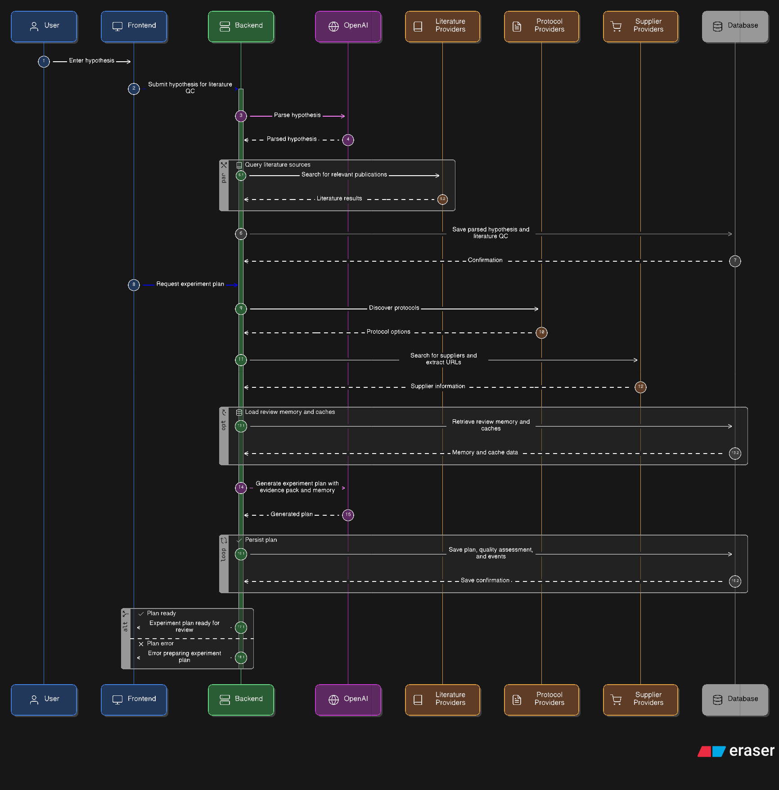
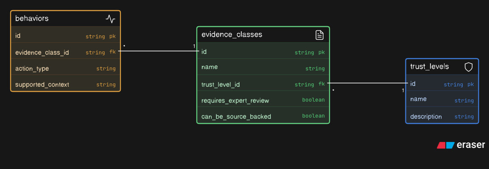
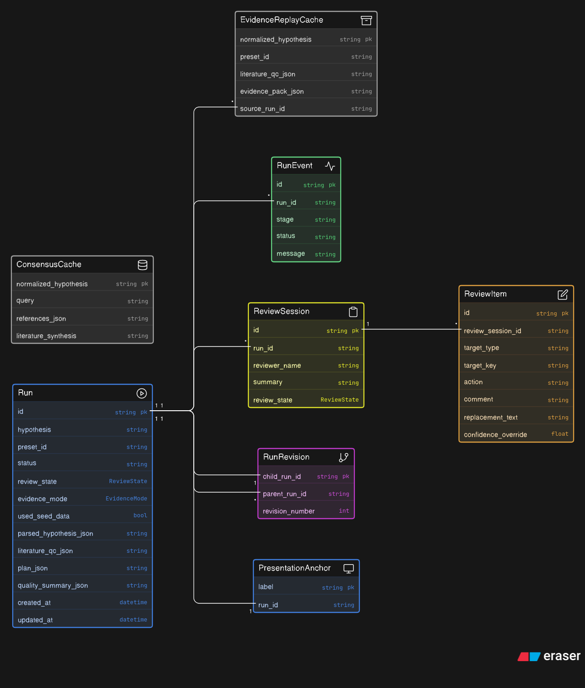
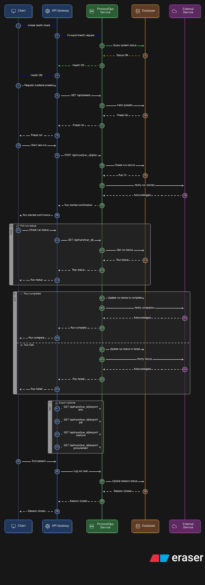

# ProtocolOps Diagram Browser

This page collects the rendered diagram PNGs and the matching PlantUML sources.

## Architecture

High-level system view of the React frontend, FastAPI backend, provider layer, persistence, exports, and review memory.

Source: [`architecture.puml`](architecture.puml)

## Three-stage workflow

End-to-end planning flow from natural-language hypothesis to review-ready experiment plan and downstream review/export actions.

Source: [`three_stage_workflow.puml`](three_stage_workflow.puml)

## Provider routing

Domain-routed provider strategy showing how Literature QC and EvidencePack source ordering differ across the four supported scientific routes.

Source: [`provider_routing.puml`](provider_routing.puml)

## EvidencePack sequence

Sequence view of how the frontend, backend, OpenAI, provider layer, and database interact during QC and plan generation.

Source: [`evidence_pack_sequence.puml`](evidence_pack_sequence.puml)

## Evidence trust model

Trust levels, evidence classes, and the rule that adjacent/community/assumption-backed content remains expert-review-required.

Source: [`evidence_trust_model.puml`](evidence_trust_model.puml)

## Evidence modes

Configured evidence modes versus realized run outcomes, including strict-live failure/degradation behavior and cached-live replay.

Source: [`evidence_modes.puml`](evidence_modes.puml)

## Review memory loop

How ProtocolOps stores structured scientist corrections and reuses them at prompt time for similar future runs.

Source: [`review_memory_loop.puml`](review_memory_loop.puml)

## Database model

Current SQLModel persistence layout including runs, caches, review sessions, events, revisions, and presentation anchors.

Source: [`database_model.puml`](database_model.puml)

## API map

Current FastAPI route surface, including planning, review, revision, comparison, and export endpoints.

Source: [`api_map.puml`](api_map.puml)

